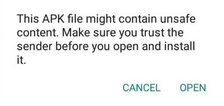
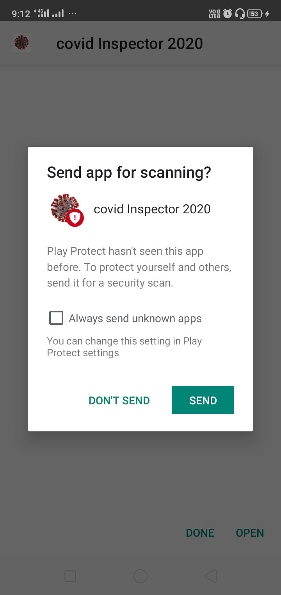
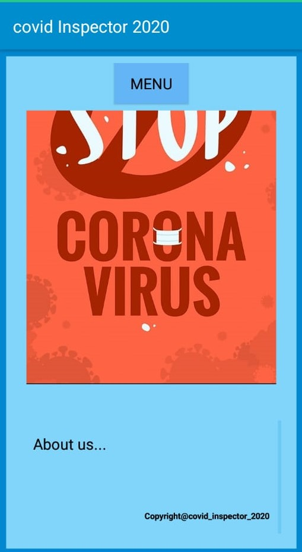

# About Corona Inspector 2020 Android Application features details
## Introduction

Corona Inspector is an android application which is used to detect whether a person is having Corona or not with more than 85 % accuracy. This application is useful for detecting corona positive patients. It is based on Machine Learning model with Python-3. It has two model: model -1 is basic model and model-2 is advanced model, which is select own by application as per patient symptoms. Every one can use this application whether it is belongs to technical background or not. It has also added government and other corona information site for COVID latest details. 

# Installation Procedure
1. Click on the apk file.
2. <b>Click on the open   :    </b>
 

3. <b>Click on the the Install :  </b>

 

4. <b>Click on the Install Anyway : </b>

 

5. <b>Click on the Dont_send : </b>

 

6. <b>Click on the Open :  </b>

 

7. <b>Click on the Menu :  </b>

 

# Menu Description:

<b> Starting Splash Screen of App           :       </b>
 

<b> Starting Splash Screen of App    :       </b>

 

### Menu of this application shown below :

<b> Main Menu of App            :   </b>
 

<b> Clicked Main Menu of App      :            </b>

### Main menu brief discription :
<dl>
  <dt>Corona test - </dt>
  <dd> By clicking on corona test the user will redirect to the site where there is a symptom checker form which is required to fill by user.
       
  </b>
     
  If on first page modal predict user vulnerable than  the user will be  redirected to the second page which is created using advanced model for better prediction.
     
  </b>
 
     
  Then user will fill the second form and hit submit button than model will predict whether it is COVID positive or not.</dd> 
    
  </b>
    
   ## About buttons on the page:-
 
 <dt>Back to app menu</dt>
  <dd>Click on the button "BACK TO APP MENU" for the main menu </dd>
  
   <dt>Back to web menu</dt>
  <dd>Click on the button "BACK TO WEB MENU" for the web menu </dd>
  
   <dt>Zoom in</dt>
  <dd>Click on the button "ZOOM IN" to zoom-in your form </dd>
  
   <dt>Zoom out</dt>
  <dd>Click on the button "ZOOM OUT" to zoom-out your form </dd>
  
   <dt>Refresh</dt>
  <dd>Click on the button "REFRESH" to refresh your form </dd>
 
  
  
  <dt>Corona Image</dt>
  <dd>- where you can search for Corona related images. This is corona images on google. </dd>
  
</b>

    <dt>Corona Information and Tips </dt>
    <dd>- by clicking on this option the user will redirect to the ministry of health and family welfare site for checking COVID related updates. This also contain tips, song and worldinfo site also for more corona updates.</dd>
     
    
</b>

     
   <dt>Lockdown @21 </dt>
   <dd>- by clicking on this option the user will redirect to the site lockdown@21 which is a blog site of us. This  contain post related to corona and lockdown.</dd>
    
   </b>

    
   <dt> About Us </dt>
   <dd>- This contain basic information about application.</dd>
    
   </b>

    
   <dt> Exit </dt>
   <dd>- to exit out of the application.</dd>
</dl>

